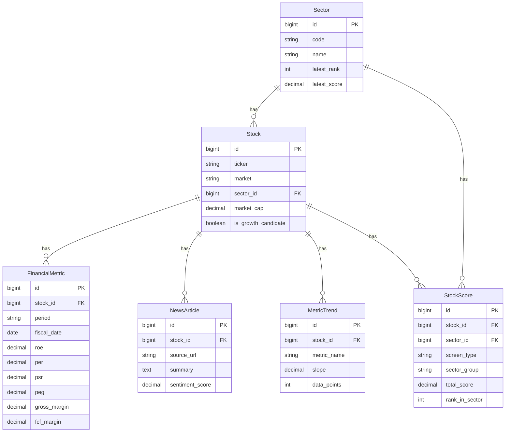

# 03 — 데이터 모델 & DB 스키마

## 마이그레이션

- **Flyway** 사용. `src/main/resources/db/migration/V1__init.sql` 형식.
- 엔티티 변경 시 새 마이그레이션 파일 추가 (기존 파일 수정 금지).
- `ddl-auto: validate` 로 설정 (Flyway가 스키마 관리, JPA는 검증만).

## 핵심 엔티티 (Phase 1)

### Stock (종목 마스터)

미장 전용이지만, 추후 국장 확장 고려해 `market` 컬럼 포함.

| 컬럼 | 타입 | 설명 |
|------|------|------|
| id | BIGINT PK | 내부 ID |
| ticker | VARCHAR(20) | 티커 (예: AAPL) |
| market | VARCHAR(10) | 'US' (추후 'KR') |
| company_name | VARCHAR(255) | 회사명 |
| sector_id | BIGINT FK | 섹터 |
| industry | VARCHAR(100) | 산업 |
| market_cap | DECIMAL(20,2) | 시가총액 (USD) |
| exchange | VARCHAR(50) | 거래소 |
| website | VARCHAR(255) | |
| employee_count | INT | |
| ipo_date | DATE | |
| is_growth_candidate | BOOLEAN | 성장주 후보 플래그 |
| updated_at | TIMESTAMP | |

> **통합 식별**: `(market, ticker)` 복합 유니크. 추후 국장은 `market='KR'`, `ticker`에 종목코드(예: '005930').

### Sector

| 컬럼 | 타입 | 설명 |
|------|------|------|
| id | BIGINT PK | |
| code | VARCHAR(50) | 섹터 코드 (예: 'SEMICONDUCTOR') |
| name | VARCHAR(100) | 표시명 (예: '반도체') |
| latest_rank | INT | 최신 유망도 순위 (1~5) |
| latest_score | DECIMAL(5,2) | 최신 점수 |
| ranked_at | TIMESTAMP | 랭킹 산출 시각 |

### FinancialMetric (시계열 재무지표)

| 컬럼 | 타입 | 설명 |
|------|------|------|
| id | BIGINT PK | |
| stock_id | BIGINT FK | |
| period | VARCHAR(10) | 'annual' / 'quarterly' |
| fiscal_date | DATE | 회계 기준일 |
| roe | DECIMAL(10,4) | |
| roa | DECIMAL(10,4) | |
| roic | DECIMAL(10,4) | |
| per | DECIMAL(10,4) | |
| pbr | DECIMAL(10,4) | |
| eps | DECIMAL(10,4) | |
| debt_ratio | DECIMAL(10,4) | 부채비율 |
| interest_coverage | DECIMAL(10,4) | 이자보상배율 |
| revenue_growth_yoy | DECIMAL(10,4) | 매출성장률 |
| operating_margin | DECIMAL(10,4) | 영업이익률 |
| ocf_to_ni | DECIMAL(10,4) | 영업현금흐름/순이익 |
| psr | DECIMAL(10,4) | Price-to-Sales (TTM) — V4 추가 |
| peg | DECIMAL(10,4) | PEG 비율 (TTM) — V4 추가. 음수=적자 |
| gross_margin | DECIMAL(10,4) | 매출총이익률 (TTM) — V4 추가 |
| fcf_margin | DECIMAL(10,4) | FCF 마진 (최근 분기 시리즈[0]) — V4 추가 |
| created_at | TIMESTAMP | |

> 유니크: `(stock_id, period, fiscal_date)`

### NewsArticle (뉴스 + LLM 분석)

원문 재배포 금지 → **링크 + 요약 + 메타데이터만 저장**.

| 컬럼 | 타입 | 설명 |
|------|------|------|
| id | BIGINT PK | |
| stock_id | BIGINT FK | |
| source | VARCHAR(100) | 출처 (예: 'Reuters') |
| source_url | VARCHAR(500) | 원문 링크 |
| headline | VARCHAR(500) | 헤드라인 |
| published_at | TIMESTAMP | |
| summary | TEXT | LLM 3줄 요약 |
| sentiment_score | DECIMAL(3,2) | -1.0 ~ 1.0 |
| importance_score | INT | 0 ~ 100 |
| relevance | VARCHAR(10) | HIGH/MEDIUM/LOW |
| llm_processed | BOOLEAN | LLM 처리 완료 여부 |
| created_at | TIMESTAMP | |

> 유니크: `source_url` (중복 수집 방지). **원문 본문(content) 컬럼 절대 저장 금지.**

### MetricTrend (지표 추세 — V4 추가)

시계열 선형회귀 기울기. `TrendCalculator`가 Finnhub series 데이터로 계산·저장. `ScoringService`가 성장주 스코어링에 사용.

| 컬럼 | 타입 | 설명 |
|------|------|------|
| id | BIGINT PK | |
| stock_id | BIGINT FK | |
| metric_name | VARCHAR(50) | 'grossMargin' / 'roic' / 'operatingMargin' / 'fcfMargin' |
| slope | DECIMAL(12,6) | 분기당 변화율 (LSQ 기울기) |
| data_points | INT | 계산에 사용된 유효 포인트 수 |
| calculated_at | TIMESTAMP | |

> 유니크: `(stock_id, metric_name)`. Upsert 방식으로 갱신.

### StockScore (사전 계산 스코어 — V4 추가)

`ScoringService` 배치가 섹터 내 백분위 기반으로 계산·저장. API는 이 테이블만 조회 (실시간 계산 금지).

| 컬럼 | 타입 | 설명 |
|------|------|------|
| id | BIGINT PK | |
| stock_id | BIGINT FK | |
| sector_id | BIGINT FK | |
| screen_type | VARCHAR(20) | 'LARGE_CAP' / 'GROWTH' |
| sector_group | VARCHAR(20) | 'GROWTH_TECH' / 'TRADITIONAL' |
| total_score | DECIMAL(5,2) | 0~100 가중합 점수 |
| rank_in_sector | INT | 섹터 내 순위 |
| score_detail | JSON | 지표별 백분위 JSON (디버그용) |
| updated_at | TIMESTAMP | |

> 유니크: `(stock_id, screen_type)`. 인덱스: `(sector_id, screen_type, rank_in_sector)`.

### ApiCallLog (Rate Limit 추적)

| 컬럼 | 타입 | 설명 |
|------|------|------|
| id | BIGINT PK | |
| provider | VARCHAR(50) | 'finnhub'/'fred'/'gemini' |
| endpoint | VARCHAR(255) | |
| called_at | TIMESTAMP | |
| status | VARCHAR(20) | SUCCESS/RATE_LIMITED/ERROR |

## ERD

## 마이그레이션 이력

| 파일 | 내용 |
|------|------|
| `V1__init.sql` | Sector, Stock, FinancialMetric, NewsArticle, ApiCallLog 초기 스키마 |
| `V2__*` | (있는 경우) |
| `V3__*` | (있는 경우) |
| `V4__add_scoring_tables.sql` | FinancialMetric에 psr/peg/gross_margin/fcf_margin 컬럼 추가; MetricTrend, StockScore 테이블 생성 |

> Flyway가 실제로 동작하지 않는 환경(로컬 등)에서는 `docker cp V4.sql <container>:/tmp/` + `mysql source` 로 수동 적용.

## 규칙

- 금액/지표는 `DECIMAL` 사용 (절대 `float`/`double` 금지 — 정밀도 문제).
- 모든 테이블에 `created_at` (+ 변경되는 건 `updated_at`).
- 인덱스: `Stock(sector_id)`, `Stock(market_cap)`, `NewsArticle(stock_id, published_at)`, `FinancialMetric(stock_id, fiscal_date)`, `StockScore(sector_id, screen_type, rank_in_sector)`, `MetricTrend(stock_id, metric_name)`.
